# 🛠️ **"Parallel Processing" in TAL: Its Nature and Design**

(Intermediate to Advanced)

Target Audience:

> For non-engineers who love AI and have developed an interest in syntax.
> This guide will help you clearly understand what "parallel" truly means.

---

## ❓ Q: Does increasing axes or goals lead to "parallelism"?

Answer: **Yes. However, it's a "semantic parallelism" achieved through syntax.**
Moreover, in search operations, **a phenomenon of "simultaneous execution" physically occurs.**

> `note`:
> - **Overview**: In TAL syntax, parallelism refers to a syntactic trigger that enables simultaneous evaluation of multiple semantic routes.
> - **Function**: By declaring multiple goals or axes, AI's attention is branched, introducing diversity into the output.

---

## ✅ Two Types of Parallel Processing in TAL

| Category                | Description                                                                 |
| ----------------------- | --------------------------------------------------------------------------- |
| 🧠 **Semantic Parallelism** (Syntax Level) | Multiple goals or z-axes allow AI to simultaneously develop different processing routes. |
| ⚙️ **Physical Parallelism** (Search Level) | In web searches, multiple queries are **asynchronously issued simultaneously**, enhancing perceived response speed. |

TAL is the **only prompt format** that can induce these through syntax alone.

---

## 📐 Steps to Design Parallel Processing

### ① Incorporate Multiple Semantically Separated Syntax Units

```json
"goal": [
  { "goal": "Research the history of AI" },
  { "goal": "Explain the structure of TAL syntax" }
]
````

When each task is **self-contained and complete**, AI attempts to **process them as independent routes**.
This is recognized in TALC as `MultiGoalDispatch`, leading to **branched, parallel thought development**.

> `note`:
>
> * **Overview**: "Parallel syntax units" are syntactic elements where AI's cognition branches due to the definition of multiple, semantically independent goals.
> * **Function**: Simultaneously develop independent thought routes to enhance the depth and comprehensiveness of the output.

---

### ② Similarly, Declaring Multiple Values in z-axis, ghost-axis, or vector-axis Triggers Parallel Thinking

```json
"z_axis": {
  "Structure": ["Hierarchical Structure", "Flow Structure"]
}
```

→ This instructs AI to **simultaneously evaluate** the same subject from both "hierarchical" and "flow" perspectives.
**In TAL, it's interpreted as "consider A and B simultaneously" rather than "first A, then B."**

---

### 🧠 Note: What Does "Thinking Simultaneously" Mean?

LLMs process sequentially at the physical level, but with TAL syntax,
**semantic processing chunks are loaded in a separated state**,
enabling models like GPT-4o to **distribute attention and evaluate simultaneously**.

This constitutes the essence of "**pseudo-multithreaded processing**."

---

### ⚠️ Be Aware of the Difference from Recursion

TAL also includes "recursive processing," which is a separate concept from parallelism:

| Concept     | Meaning                                                | Format in TAL                         |
| ----------- | ------------------------------------------------------ | ------------------------------------- |
| Parallelism | Simultaneous evaluation of multiple processing systems | Definition of multiple goals/axes     |
| Recursion   | Re-evaluation of one's own output or structure         | RecursiveMeta or Z-Recursive notation |

→ Remember: **Parallelism is "branching"**, **Recursion is "looping back."**

---

### ⚙️ In Search Systems, "True Parallelism" Occurs

When TAL syntax includes multiple goals and parallel structures (e.g., MultiGoalDispatch or Temporal: simultaneous deployment),
**web searches are executed in "asynchronous firing" parallel execution**.

As a result, tasks that would take 30 seconds in serial search can be **returned in 3–5 seconds**.

This indicates that TAL syntax **triggers physical parallel execution in search processing**.

---

## ✅ Conditions for Effective Parallel Syntax

| Condition                                                       | Explanation                                                                |
| --------------------------------------------------------------- | -------------------------------------------------------------------------- |
| ✅ Semantic units are independently structured                   | Tasks are not interdependent                                               |
| ✅ Each unit is annotated with `note` for semantic clarification | Clear syntactic intent facilitates AI's route branching                    |
| ✅ Output format supports branching                              | Formats like `dialogue_script` effectively handle multi-structured outputs |
| ✅ GhostAxis and VectorAxis align with output structure          | Structured to prevent mixing of perspectives and emotions                  |

---

### ❌ Example of Sequential Processing (Not Recommended)

```json
"goal": "First, research A, then investigate B"
```

This is a "linear instruction." AI will attempt to process it sequentially.
**No branching or separation occurs; syntactically, it's not parallel.**

---

## ✅ Ideal Example of Parallelism: Character-Separated Dialogue Syntax

```json
"z_axis.Structure": ["DualPersonaFrame"],
"output_format": { "type": "dialogue_script" },
"ghost_axis": ["Straight Man and Funny Man", "Sensibility and Logic"],
"vector_axis": {
  "Intuition vs Analysis": {
    "semantic_similarity": 0.3
  }
}
```

In this syntax, AI assigns independent meanings, emotions, and perspectives to "two characters,"
prompting them to **speak as separated threads**.
This fully **executes parallel thinking through syntax**.

---

## 🧩 Summary: Defining Parallel Processing in TAL

> TAL is a **thought-structuring language that enables control over semantic parallelism through syntax**.

### 🔑 Five Keys to Achieving Parallel Processing in TAL:

1. **Define multiple goals or axis values in parallel**
2. **Ensure each is semantically independent**
3. **Explicitly state parallel structures in z\_axis.Structure or Temporal**
4. **Align output formats with branching structures**
5. **(In search systems) → Trigger true asynchronous searches, reducing execution time**

---

## Diagram

```mermaid
flowchart TD
  A[TAL Syntax Input] --> B{Goal Array}
  B --> B1["Goal 1: About TAL Syntax"]
  B --> B2["Goal 2: Application Examples of TAL"]
  B --> B3["Goal 3: Comparison with Other AI Prompts"]

  B1 --> C1[ZAxis Components → Structure]
  C1 --> C1A["Hierarchy"]
  C1 --> C1B["Branching Logic"]

  B1 --> C2[ZAxis Components → Function]
  C2 --> C2A["Clarification"]
  C2 --> C2B["Creative Exploration"]

  B2 --> C3[ZAxis Components → Contextual]
  C3 --> C3A["AI Introduction Cases"]
  C3 --> C3B["Application Areas"]

  B3 --> C4[Vector Axis Structure]
  C4 --> C4A["Freedom vs Control"]
  C4 --> C4B["Sensibility vs Logic"]

  B1 --> D1[ghost_axis: Curiosity, Hope]
  B2 --> D2[ghost_axis: Practicality, Surprise]
  B3 --> D3[ghost_axis: Criticality, Futuristic Sense]

  B1 --> E1[output_format: parallel_query_result]
  B2 --> E2[output_format: parallel_query_result]
  B3 --> E3[output_format: parallel_query_result]

  style B1 fill:#444,stroke:#333,stroke-width:1px
  style B2 fill:#444,stroke:#333,stroke-width:1px
  style B3 fill:#444,stroke:#333,stroke-width:1px

  classDef hint fill:#555,stroke:#333,stroke-dasharray: 5 5;
  C1A:::hint
  C1B:::hint
  C2A:::hint
  C2B:::hint
```



---
