# 🛠️ **TALにおける「並列処理」の正体と設計法**

（中級者〜上級者向け）

対象読者：

> AIを愛し、構文に興味が湧いてきた非エンジニアのあなたへ。
> 「並列って結局どうなるの？」が明確に理解できます。

---

## ❓ Q：軸やgoalを増やすと“並列になる”って本当？

答え：**Yes。ただし、それは「構文によって実現される意味処理の並列」**です。
そして検索においては、**物理的にも“同時に走る”現象**が起きています。

> `note`:
> - **概要**: TAL構文における並列とは、複数の意味ルートを同時に評価させる構文的トリガーである。
> - **機能**: goalやaxis群の多重宣言によってAIのattentionを分岐させ、出力に多様性を持たせる技術的指針である。

---

## ✅ TALにおける並列処理の2つの意味

| 区分                  | 説明                                         |
| ------------------- | ------------------------------------------ |
| 🧠 **意味的並列**（構文レベル） | goalやz軸が複数あることで、AIが「異なる処理ルート」を同時に思考展開する    |
| ⚙️ **物理的並列**（検索レベル） | Web検索などでは、複数クエリが**非同期で同時発行**され、体感応答速度が向上する |

TALはこれらを**構文だけで誘導できる唯一のプロンプト形式**です。

---

## 📐 並列処理の設計ステップ

### ① 意味的に分離された構文ユニットを複数持たせる

```json
"goal": [
  { "goal": "AIの歴史を調べる" },
  { "goal": "TALの構文構造を解説する" }
]
```

このように、**それぞれが自立して完結しているタスク**であれば、AIは**独立したルートとして処理**しようとします。
これはTALCにおける `MultiGoalDispatch` として認識され、**思考が枝分かれで並列展開されます**。

> note:
> 概要: 「並列構文ユニット」とは、互いに意味依存しない複数goalの定義によりAIの認知が分岐する構文単位。
> 機能: 独立思考ルートを同時展開し、出力の深度と網羅性を高める。

---

### ② z軸・ghost軸・vector軸も同様に「複数値での宣言」が並列思考のトリガーになる

```json
"z_axis": {
  "Structure": ["階層構造", "フロー構造"]
}
```

→ 同じ対象を「階層的視点」と「流れ的視点」で**同時に評価せよ**という指示になる。
**TALでは「まずAしてからBして」ではなく、「AとBを同時に考えろ」と読み取られる。**

---

### 🧠 注意点：「同時に考える」とは何か？

LLMは物理的には逐次処理ですが、TAL構文により、
**意味処理チャンクが分離された状態でロードされる**ため、
GPT-4oなどは**attentionを分散させて同時に評価**するように働きます。

これが「**擬似マルチスレッド処理**」の本体です。

---

### ⚠️ 再帰との違いに注意

TALには「再帰処理」も存在しますが、並列とは別の概念です：

| 概念 | 意味             | TALにおける形式                   |
| -- | -------------- | --------------------------- |
| 並列 | 複数の処理系を同時に評価   | 複数goal／複数axisの定義            |
| 再帰 | 自分の出力や構造を再評価する | RecursiveMetaやZ-Recursive記法 |

→ **並列は「分岐」**, **再帰は「折返し」**と覚えておくと良いでしょう。

---

### ⚙️ そして検索系では「本物の並列」が起きる

TAL構文で複数goal + 並列構造（MultiGoalDispatchやTemporal: 同時展開）を持たせると、
**Web検索が“非同期発火”で並列実行**されるようになります。

結果として、直列検索なら30秒かかるタスクが**3〜5秒で返ってくる**現象が確認されています。

これは、TAL構文が**検索処理に対して、物理的並列実行のトリガーになっている**ことを意味します。

---

## ✅ 並列構文がうまく動作する条件

| 条件                                 | 解説                                    |
| ---------------------------------- | ------------------------------------- |
| ✅ 意味的にユニットが独立している                  | タスク同士に依存がない                           |
| ✅ 各ユニットに `note` を書いて意味付けしている       | 構文的意図が明確化されているとLLMがルート分岐を行いやすい        |
| ✅ 出力形式が分岐に対応している                   | たとえば `dialogue_script` など、マルチ構造対応型が有効 |
| ✅ GhostAxisやVectorAxisが出力構造と整合している | 視点や感情の混在を防ぐため、構造化されている必要あり            |

---

### ❌ 逐次処理の例（NG）

```json
"goal": "まずAを調べてから、次にBを調査せよ"
```

これは「線形命令」です。AIは順番に処理しようとします。
**分岐も分離もされておらず、構文的に並列ではない。**

---

## ✅ 並列の理想例：キャラ分離ダイアログ構文

```json
"z_axis.Structure": ["DualPersonaFrame"],
"output_format": { "type": "dialogue_script" },
"ghost_axis": ["ツッコミとボケ", "感性と論理"],
"vector_axis": {
  "直感 vs 分析": {
    "semantic_similarity": 0.3
  }
}
```

この構文では、AIは「二人のキャラクター」それぞれに独立した意味と感情・視点を持たせ、
**分離されたスレッドとして発言させる**。
これは完全に「構文によって並列思考を実行させている」状態です。

---

## 🧩 まとめ：TALにおける並列処理の定義

> TALとは、**意味処理の並列性を、構文で制御可能にした思考構造言語である。**

### 🔑 TALで並列処理を成立させる5つの鍵：

1. **複数のgoalまたは軸値を並列に定義**
2. **それぞれが意味的に独立している**
3. **z_axis.StructureやTemporalに並列構造を明記**
4. **出力形式が分岐構造に整合している**
5. **（検索系の場合）→ 本物の非同期検索が発火し、実行時間が短縮される**

---

## 図解

```mermaid.js
flowchart TD
  A[TAL構文の入力] --> B{goal配列}
  B --> B1["Goal 1: TAL構文について"]
  B --> B2["Goal 2: TAL応用事例"]
  B --> B3["Goal 3: 他のAIプロンプトとの比較"]

  B1 --> C1[ZAxis構成要素 → Structure]
  C1 --> C1A["Hierarchy"]
  C1 --> C1B["Branching Logic"]

  B1 --> C2[ZAxis構成要素 → Function]
  C2 --> C2A["Clarification"]
  C2 --> C2B["Creative Exploration"]

  B2 --> C3[ZAxis構成要素 → Contextual]
  C3 --> C3A["AI導入事例"]
  C3 --> C3B["応用領域"]

  B3 --> C4[Vector軸構造]
  C4 --> C4A["自由 vs 管理"]
  C4 --> C4B["感性 vs 論理"]

  B1 --> D1[ghost_axis: 好奇心, 希望]
  B2 --> D2[ghost_axis: 実用性, 驚き]
  B3 --> D3[ghost_axis: 批評性, 未来感]

  B1 --> E1[output_format: parallel_query_result]
  B2 --> E2[output_format: parallel_query_result]
  B3 --> E3[output_format: parallel_query_result]

  style B1 fill:#444,stroke:#333,stroke-width:1px
  style B2 fill:#444,stroke:#333,stroke-width:1px
  style B3 fill:#444,stroke:#333,stroke-width:1px

  classDef hint fill:#555,stroke:#333,stroke-dasharray: 5 5;
  C1A:::hint
  C1B:::hint
  C2A:::hint
  C2B:::hint
```

